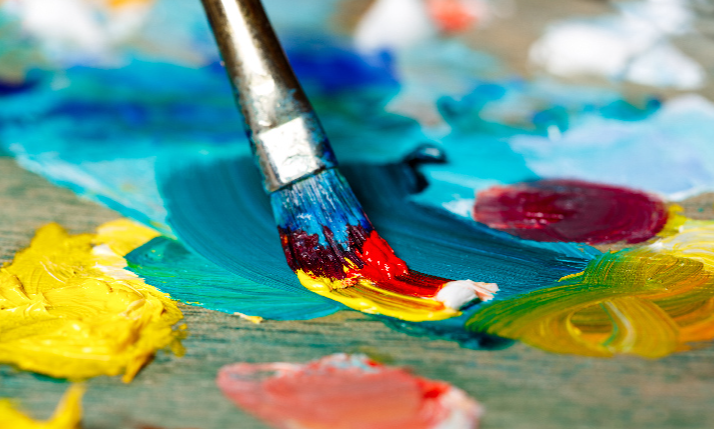

[← Volver al inicio](README.md)

# Temas del curso

### 16/09 · Mis aficiones

Llevo pinbtando desde que tengo 8 años. He ido a clases de pintura y de pintura textil hasta es año pasado. He pintado todo tipo de ropa y objetos ya que le puedes dar un toque muy personal a lo que quieras y hacer buenos regalos pero, lo que más me gusta es la tranquilidad que me transmite la actividad y poder aprender y superar mis propias pinturas y texturas. Me ayudaba mucho para desestresarme y aumentar mi creatividad.

Busacando en Github he encojntrado esto [lllyasviel](https://github.com/lllyasviel/style2paints.git)  
Una página donde encuentras herramientas para aprender

---
