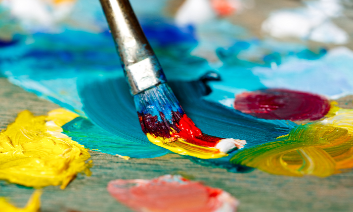

[← Volver al inicio](README.md)

# Temas del curso

### 16/09 · Mis aficiones

Llevo pinbtando desde que tengo 8 años. He ido a clases de pintura y de pintura textil hasta es año pasado. He pintado todo tipo de ropa y objetos ya que le puedes dar un toque muy personal a lo que quieras y hacer buenos regalos pero, lo que más me gusta es la tranquilidad que me transmite la actividad y poder aprender y superar mis propias pinturas y texturas. Me ayudaba mucho para desestresarme y aumentar mi creatividad.

Busacando en Github he encojntrado esto [lllyasviel](https://github.com/lllyasviel/style2paints.git)  
Una página donde encuentras herramientas para aprender

---

### 28/09 · Premios Princesa de Asturias: Leo Messi

Leo Messi es un futbolista argentino considerado uno de los grandes jugadores de la historia del fútbol. Ha ganado el **Premio Princesa de Asturias de los Deportes 2026**. El jurado le ha premiado por su extraordinario talento, su larga y exitosa trayectoria deportiva y, especialmente, por su labor solidaria para ayudar a niños desfavorecidos en educación y salud. También destacan su humildad, constancia y compromiso con el trabajo en equipo. **Yo lo he elegido** porque su trayectoria deportiva y su compromiso con los demás me parecen muy destacables.

[Leo Messi](https://www.fpa.es/es/premios-princesa-de-asturias/premiados/2026-leo-messi/?texto=acta)

Imagen: AUTOR, [Wikimedia Commons](https://commons.wikimedia.org/wiki/Category:Lionel_Messi)
